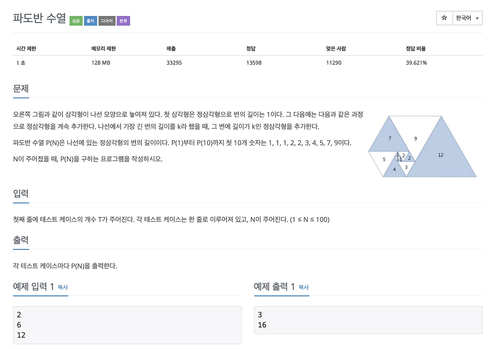

# 파도반 수열

**출처**: 백준 9461  
**유형**: 1D DP  
**제한**: 시간 1초 | 메모리 128MB | N ≤ 100

## 문제



아래 그림과 같이 정삼각형들을 붙여나가며 만드는 수열이 있습니다.

- 첫 번째 삼각형의 변의 길이는 1
- 수열 P(N)은 N번째 삼각형의 변의 길이

규칙:
- P(1) = P(2) = P(3) = 1
- P(N) = P(N-2) + P(N-3) (N ≥ 4)

테스트 케이스 T개가 주어지고, 각 N에 대해 P(N)을 출력하세요.

## 입력

첫째 줄: T (테스트 케이스 수)  
이후 T줄: 각각 N

## 출력

각 N에 대해 P(N) 출력

## 예제 1

**입력**
```
2
6
12
```
**출력**
```
3
16
```